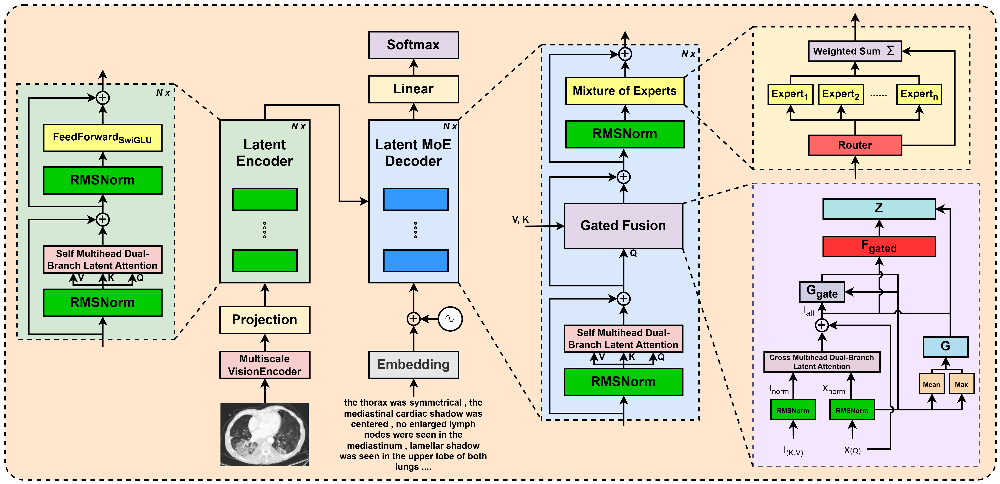

<h1 align="center">MicarVLMoE: A modern gated cross-aligned vision-language mixture of experts model for medical image captioning and report generation</h1>

<p align="center">
  <strong>
    <a href="https://scholar.google.com/citations?user=FeMCtswAAAAJ&hl=en">Amaan Izhar</a>,
    <a href="https://scholar.google.com/citations?user=TyH59tkAAAAJ&hl=en">Nurul Japar</a>,
    <a href="https://scholar.google.com.my/citations?user=IgUMlGcAAAAJ&hl=en">Norisma Idris</a>,
    <a href="https://scholar.google.com.au/citations?user=Sb1Pj4sAAAAJ&hl=en">Ting Dang</a>
  </strong>
  <br/><br/>
  <a href="https://arxiv.org/abs/2504.20343">
    
  </a>
</p>

---

## 📄 Abstract
<p align="justify">Medical image reporting (MIR) aims to generate structured clinical descriptions from radiological images. Existing methods struggle with fine-grained feature extraction, multimodal alignment, and generalization across diverse imaging types, often relying on vanilla transformers and focusing primarily on chest X-rays. We propose MicarVLMoE, a vision-language mixture-of-experts model with gated cross-aligned fusion, designed to address these limitations. Our architecture includes: (i) a multiscale vision encoder (MSVE) for capturing anatomical details at varying resolutions, (ii) a multihead dual-branch latent attention (MDLA) module for vision-language alignment through latent bottleneck representations, and (iii) a modulated mixture-of-experts (MoE) decoder for adaptive expert specialization. We extend MIR to CT scans, retinal imaging, MRI scans, and gross pathology images, reporting state-of-the-art results on COVCTR, MMR, PGROSS, and ROCO datasets. Extensive experiments and ablations confirm improved clinical accuracy, cross-modal alignment, and model interpretability.</p>

---

## 🏗️ Architecture

<p align="center">
  
</p>

---

## 📚 Citation

If you find this work useful, please consider citing our paper and giving this repository a ⭐:

```bibtex
@inproceedings{izhar2025micarvlmoe,
  title={MicarVLMoE: A modern gated cross-aligned vision-language mixture of experts model for medical image captioning and report generation},
  author={Izhar, Amaan and Japar, Nurul and Idris, Norisma and Dang, Ting},
  booktitle={2025 International Joint Conference on Neural Networks (IJCNN)}, 
  year={2025},
  pages={1-8},
  organization={IEEE}
}
```

---

## 🛠️ Reproducibility

### ✅ System Requirements

| Component      | Required Specs                       |
|----------------|--------------------------------------|
| OS             | Ubuntu 22.04                         |
| GPU            | ≥ 40 GB VRAM                         |
| RAM            | ≥ 16 GB                              |
| Disk Space     | ≥ 100 GB                             |
| Env Modules    | Miniconda                            |
| Dependencies   | CUDA ≥ 12.1                          |

---

### 📦 Environment Setup
**Run:**
```bash
# Clone the repository
git clone https://github.com/AI-14/micar-vl-moe.git
cd micar-vl-moe

# Create and activate conda environment
conda create -n env python=3.10 --yes
conda activate env

# Install dependencies
conda install pip
pip install -r requirements.txt
```

---

### 🔬 Dataset Setup & Running Experiments

#### COVCTR

**Directory Structure:**
```
data/
└── covctr/
    └── images/
    └── reports.csv
```

1. Download from [COVCTR](https://github.com/mlii0117/COV-CTR).
2. Place image files under `data/covctr/images/`.
3. Rename `reports_ZH_EN.csv` → `reports.csv` and move the report file to `data/covctr/reports.csv`.

**Run:**
```bash
python preprocessors/covctr.py

# Choose any one i.e. local or slurm
source scripts/covctr/run_exp.sh
sbatch scripts/covctr/slurm_exp.sh
```

---

#### MMRETINAL

**Directory Structure:**
```
data/
└── mmretinal/
```

1. Download from [MMRETINAL](https://github.com/lxirich/MM-Retinal).
2. Place everything under `data/mmretinal/`.

**Run:**
```bash
python preprocessors/mmretinal.py

# Choose any one i.e. local or slurm
source scripts/mmretinal/run_exp.sh
sbatch scripts/mmretinal/slurm_exp.sh
```

---

#### PGROSS

**Directory Structure:**
```
data/
└── pgross/
    └── images/
    └── captions.json
```

1. Download from [PGROSS](https://github.com/wang-zhanyu/medical-reports-datasets).
2. Remove `train_images.tsv`, `test_images.tsv`, `peir_gross.tsv`, `peir_gross_tags.json`.
2. Rename `peir_gross_captions.json` → `captions.json`.

**Run:**
```bash
python preprocessors/pgross.py

# Choose any one i.e. local or slurm
source scripts/pgross/run_exp.sh
sbatch scripts/pgross/slurm_exp.sh
```

---

#### ROCO

**Directory Structure:**
```
data/
└── roco/
    ├── parquet/
    ├── train/images/
    ├── validation/images/
    └── test/images/
```

1. Download from [ROCO](https://huggingface.co/datasets/mdwiratathya/ROCO-radiology).
2. Place all parquet files under `data/roco/parquet/`.

**Run:**
```bash
python preprocessors/roco.py

# Choose any one i.e. local or slurm
source scripts/roco/run_exp.sh
sbatch scripts/roco/slurm_exp.sh
```

---

## 🧹 Clean Up
**Run:**
```bash
cd ..
conda deactivate
conda remove --name env --all
rm -r micar-vl-moe
```

---

> ⚠️ **Note:** Experimental results can be sensitive to random seed initialization. For rigorous evaluation, it is recommended to assess performance across multiple random seeds. Additionally, modifications to the scripts may be necessary depending on the specific SLURM environment and configuration settings.
